# SkiaVclControlsfree

基于 Delphi 内置 Skia 的 Material Design VCL 控件库（精简版）

[](https://www.embarcadero.com/products/delphi)
[](LICENSE)

**[English](README_EN.md)** | 中文

---

## 特性

- **Material Design 3** 风格设计
- **Skia 渲染** - 利用 Delphi 内置 Skia 支持，高质量图形渲染
- **DPI 感知** - 完美支持高 DPI 显示
- **流畅动画** - 内置悬停、点击动画效果
- **MUI 主题** - 内置 Material-UI 配色方案
- **中文支持** - 自动检测并使用系统中文字体
- **透明渲染** - 支持 Alpha 通道透明度，父子控件透明合成
- **禁用状态** - 完整的 Enabled 禁用状态视觉支持

---

## 控件列表

### 基础控件

| 控件 | 说明 |
|------|------|
| `TDSkLabel` | Skia 绘制的透明标签，支持渐变、描边、阴影和自动大小 |
| `TDSkButton` | Material Design 按钮，支持 MUI 配色、Ripple 动画、多种样式和图标 |
| `TDSkButtonGroup` | 按钮组，支持水平/垂直排列、互斥选择 |
| `TDSkPanel` | Material Design 面板，支持多种容器样式和悬停效果 |

### 选择控件

| 控件 | 说明 |
|------|------|
| `TDSkRadio` | 单选按钮，MUI 风格，支持透明背景 |
| `TDSkRadioGroup` | 单选按钮组，自绘模式，支持标题显示 |
| `TDSkCheckbox` | 复选框，支持三态（未选中/选中/不确定） |
| `TDSkCheckboxGroup` | 复选框组，支持多选 |
| `TDSkSwitch` | 开关控件，轨道+滑块滑动开关 |
| `TDSkSwitchGroup` | 开关组 |
| `TDSkEdit` | 输入框，支持标签、占位符、清除按钮、错误状态 |
| `TDSkSelect` | 下拉选择，支持搜索、清除、多种尺寸 |

### 反馈控件

| 控件 | 说明 |
|------|------|
| `TDSkSlider` | 滑块控件，支持连续/间续/范围/垂直滑块 |
| `TDSkProgressBar` | 线性进度条，支持确定/不确定/缓冲模式 |
| `TDSkCircularProgress` | 环形进度条 |
| `TDSkSnackbar` | 消息条，支持自动隐藏和操作按钮 |

### 导航控件

| 控件 | 说明 |
|------|------|
| `TDSkTabs` | 选项卡，支持标准/底部导航样式，水平/垂直方向 |
| `TDSkStepper` | 步骤条，支持步骤状态管理和自定义内容 |

---

## 系统要求

- **Delphi 11 Alexandria** 或更高版本（需内置 Skia 支持）
- **Windows** 平台
- **Skia 包** - Delphi 安装时需选择 Skia 支持

---

## 安装

### 通过 Delphi IDE 安装

1. 克隆或下载本仓库到本地
2. 打开 `SkiaVclControls.dpk`（设计时包）
3. 在 Project Manager 中右键点击 `SkiaVclControls.bpl`
4. 选择 **Compile**，然后选择 **Install**
5. 控件将出现在组件面板的 **SkiaVclControlsfree** 页签中

---

## 快速开始

### TDSkButton 使用示例

```delphi
uses
  SkiaVclControls.Button, SkiaVclControls.Types;

procedure TForm1.FormCreate(Sender: TObject);
begin
  Button1 := TDSkButton.Create(Self);
  Button1.Parent := Self;
  Button1.ButtonText := '点击我';
  Button1.MUIColorScheme := muiPrimary;
  Button1.MUIStyle := muiContained;
  Button1.HoverEffect := heRipple;
end;
```

### TDSkRadioGroup 使用示例

```delphi
uses
  SkiaVclControls.RadioGroup, SkiaVclControls.Types;

procedure TForm1.FormCreate(Sender: TObject);
begin
  RadioGroup1 := TDSkRadioGroup.Create(Self);
  RadioGroup1.Parent := Self;
  RadioGroup1.Caption := '选择选项';
  RadioGroup1.Items.Add('选项一');
  RadioGroup1.Items.Add('选项二');
  RadioGroup1.Items.Add('选项三');
  RadioGroup1.ItemIndex := 0;
  RadioGroup1.MUIColorScheme := muiPrimary;
end;
```

---

## 项目结构

```
SkiaVclControlsfree/
├── Sources/                         # 源代码
│   ├── SkiaVclControls.Types.pas        # 共享类型、枚举
│   ├── SkiaVclControls.Base.pas         # 基类
│   ├── SkiaVclControls.LabelControl.pas # 标签
│   ├── SkiaVclControls.Button.pas       # 按钮
│   ├── SkiaVclControls.ButtonGroup.pas  # 按钮组
│   ├── SkiaVclControls.Panel.pas        # 面板
│   ├── SkiaVclControls.Radio.pas        # 单选按钮
│   ├── SkiaVclControls.RadioGroup.pas   # 单选按钮组
│   ├── SkiaVclControls.Checkbox.pas     # 复选框
│   ├── SkiaVclControls.CheckboxGroup.pas# 复选框组
│   ├── SkiaVclControls.Switch.pas       # 开关
│   ├── SkiaVclControls.SwitchGroup.pas  # 开关组
│   ├── SkiaVclControls.Slider.pas       # 滑块
│   ├── SkiaVclControls.Edit.pas         # 输入框
│   ├── SkiaVclControls.Select.pas       # 下拉选择
│   ├── SkiaVclControls.ProgressBar.pas  # 进度条
│   ├── SkiaVclControls.CircularProgress.pas # 环形进度条
│   ├── SkiaVclControls.Snackbar.pas     # 消息条
│   ├── SkiaVclControls.Stepper.pas      # 步骤条
│   ├── SkiaVclControls.Tabs.pas         # 选项卡
│   ├── SkiaVclControls.MUIHelper.pas    # MUI 配色 Helper
│   └── SkiaVclControls.Register.pas     # 组件注册
├── Demo/                            # 演示程序
│   └── AdminDemo/                   # 综合展示Demo
├── screenshots/                     # 截图
├── SkiaVclControls.dpk              # 设计时包
└── build.bat                        # 编译脚本
```

---

## 截图

### Admin 综合演示
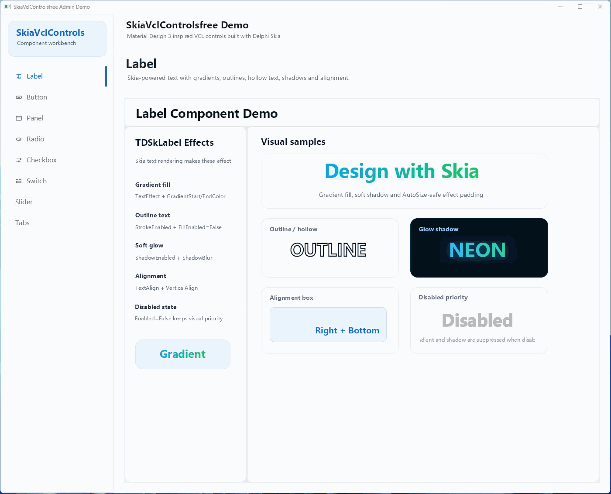

### TDSkLabel 标签
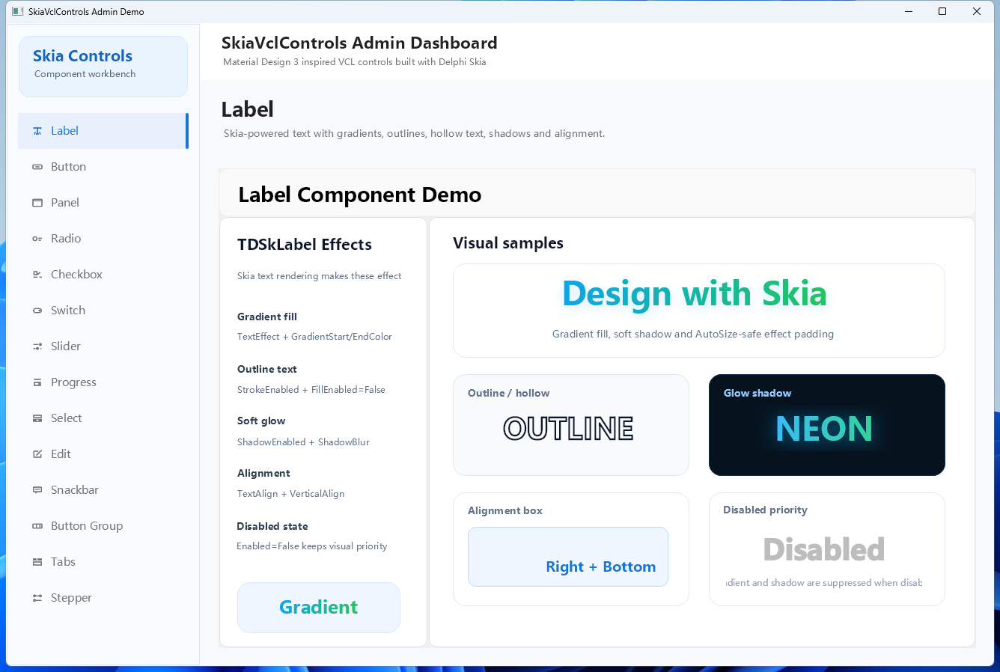

### TDSkButton 按钮
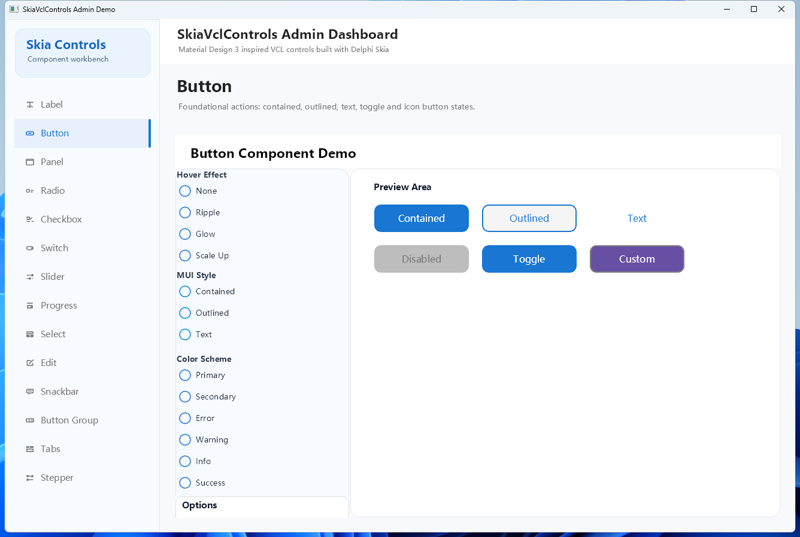

### TDSkPanel 面板
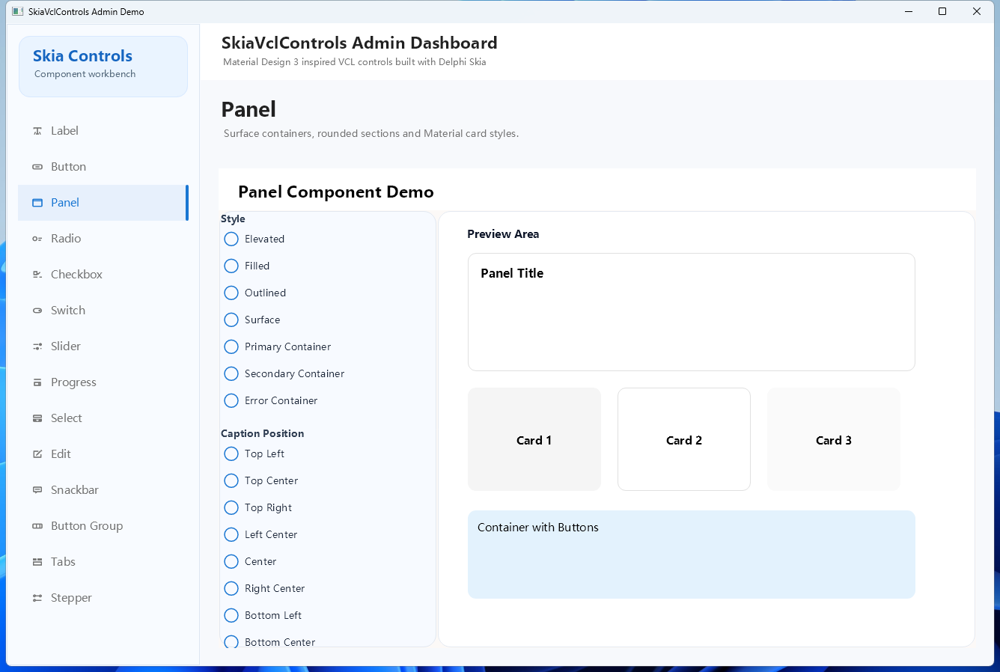

### TDSkRadio 单选按钮
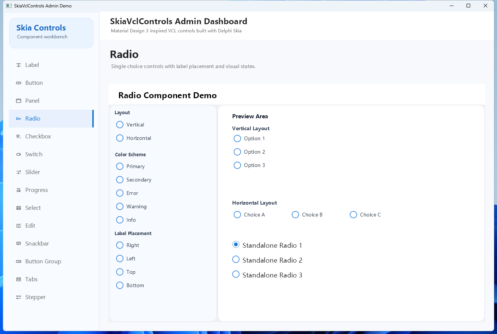

### TDSkCheckbox 复选框
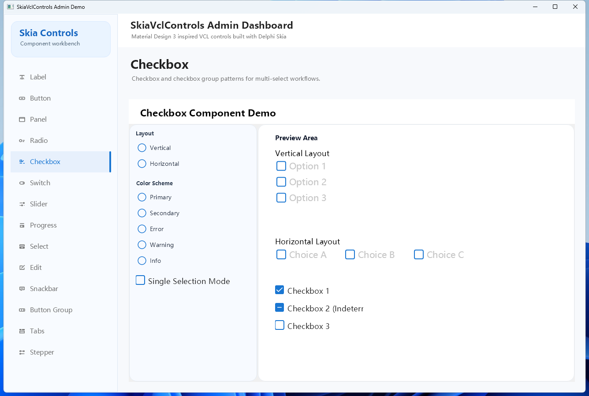

### TDSkSwitch 开关
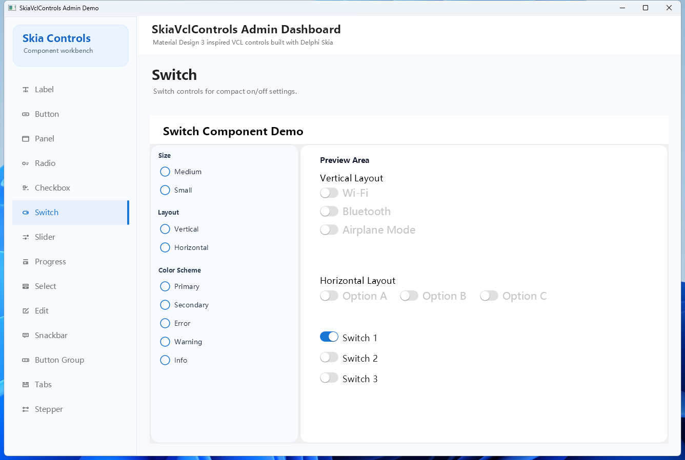

### TDSkSlider 滑块
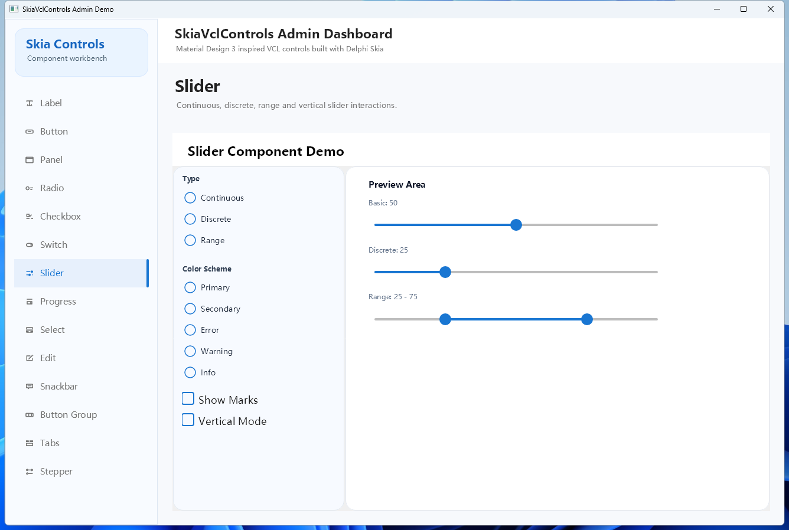

### TDSkProgressBar / TDSkCircularProgress 进度条
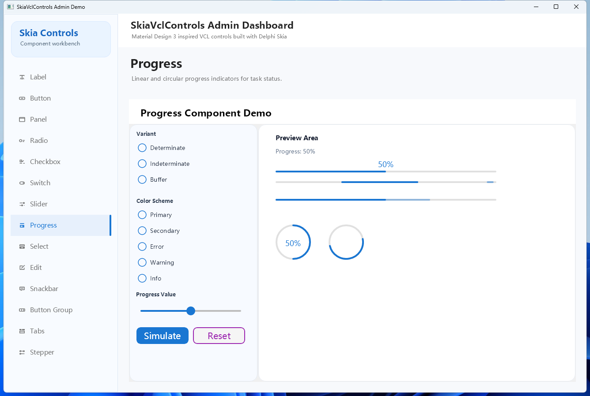

### TDSkSelect 下拉选择
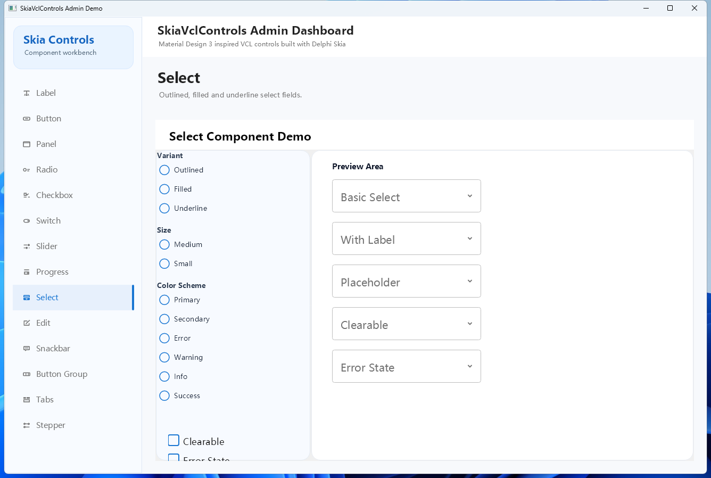

### TDSkEdit 输入框
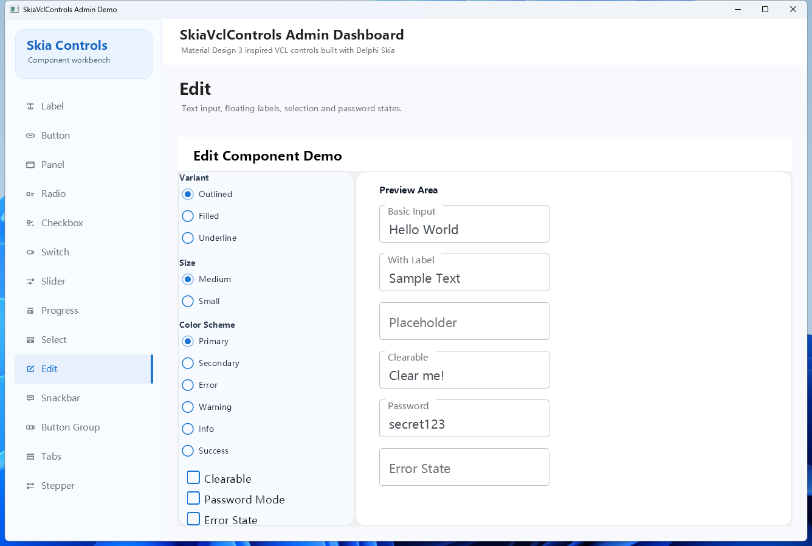

### TDSkSnackbar 消息条
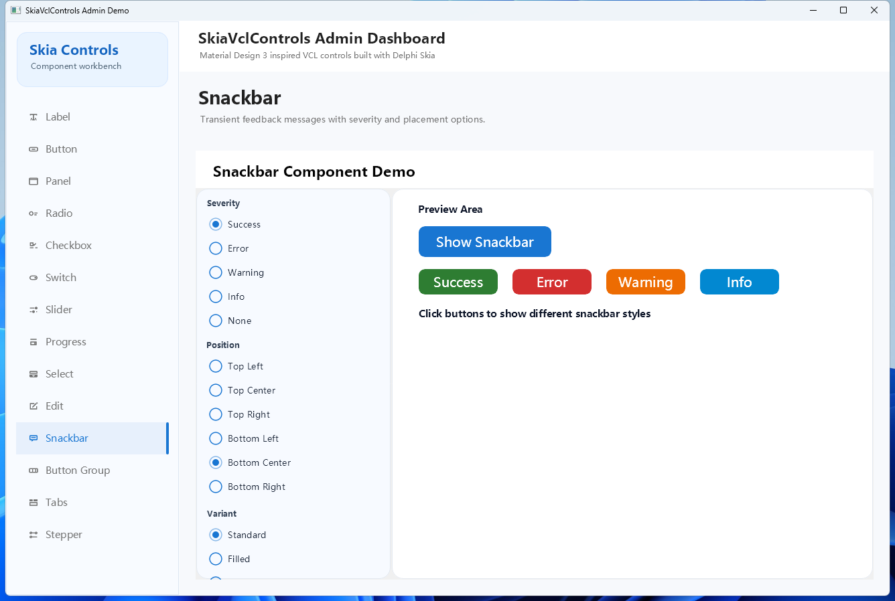

### TDSkButtonGroup 按钮组
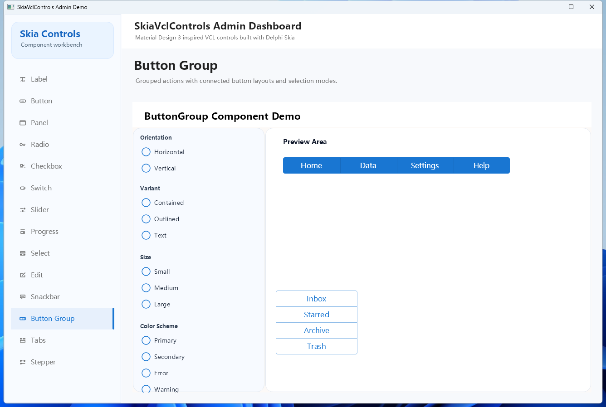

### TDSkTabs 选项卡
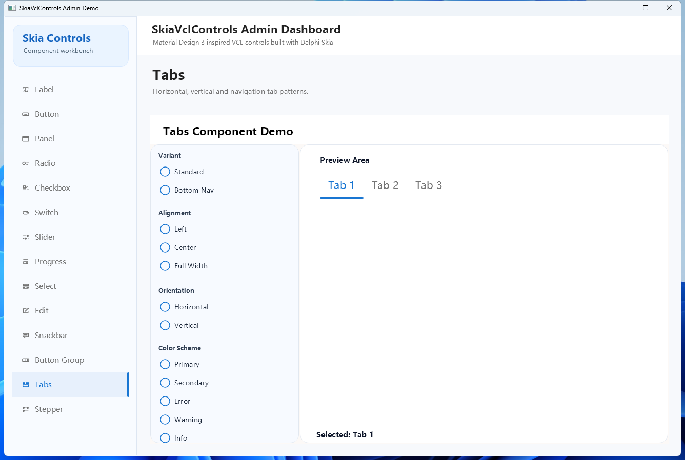

### TDSkStepper 步骤条
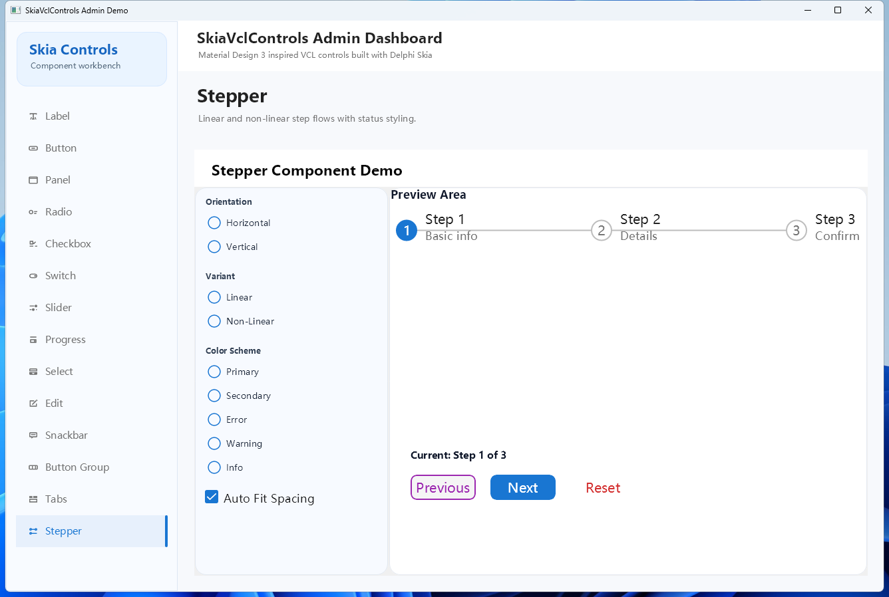

---

## 许可证

本项目采用 [MIT](LICENSE) 许可证

---

## 致谢

- [Skia](https://skia.org/) - 强大的 2D 图形库
- [Material Design](https://m3.material.io/) - Google Material Design 3
