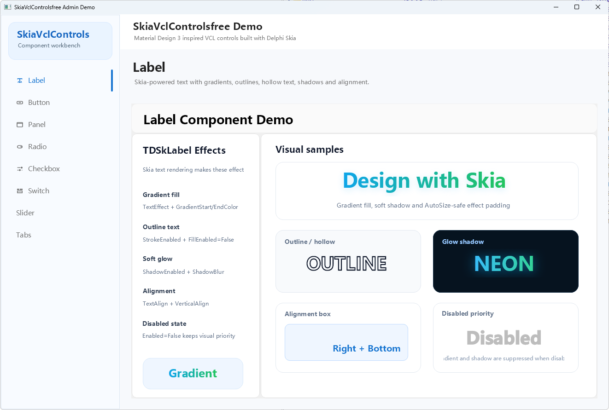
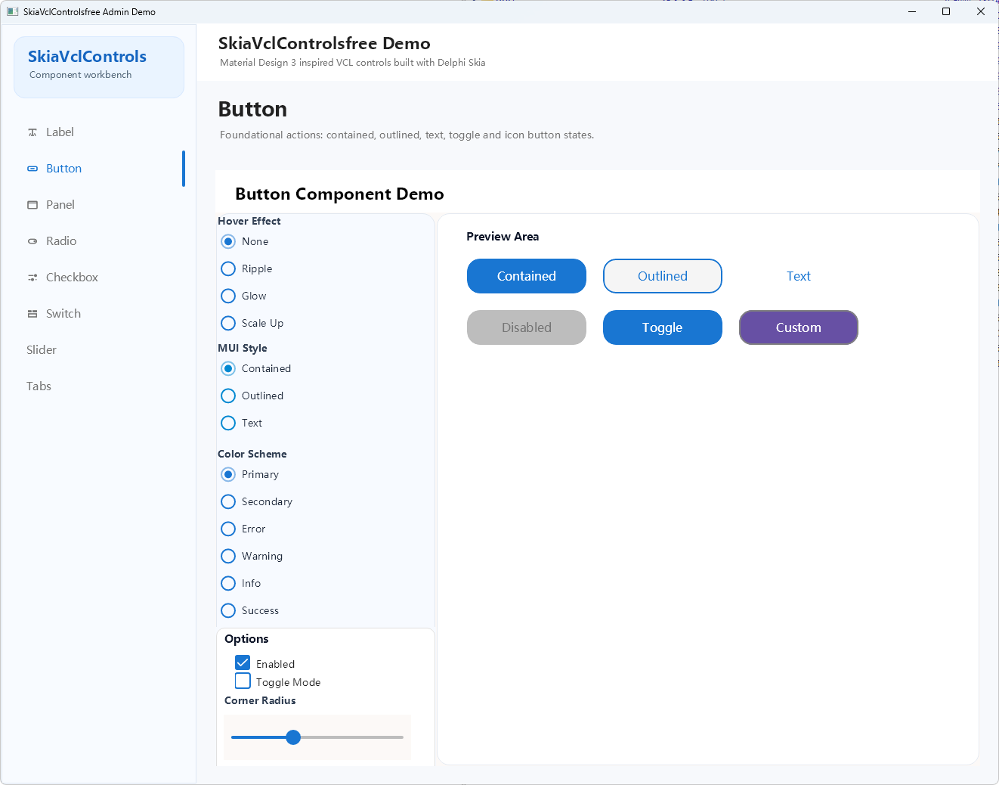
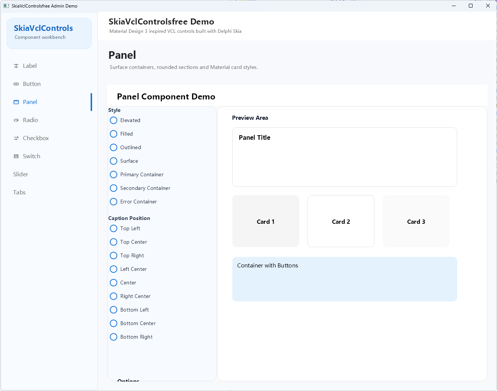
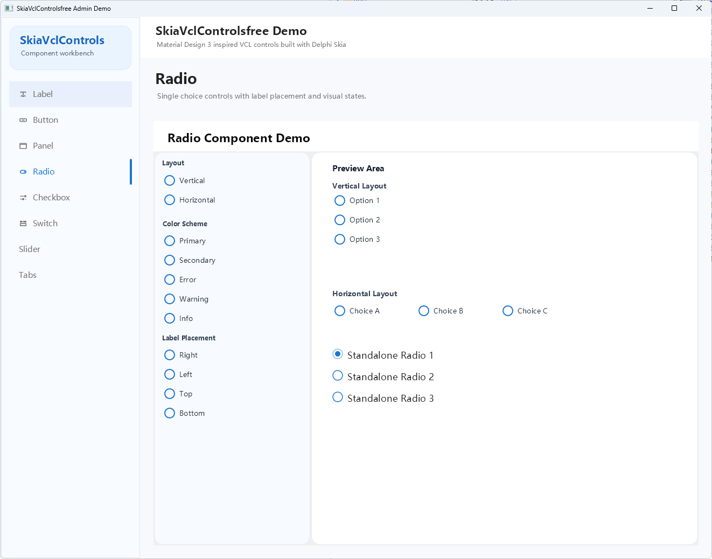
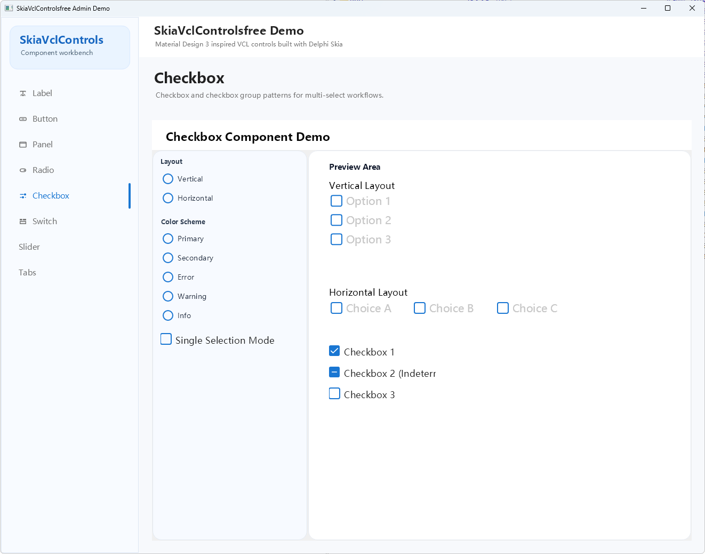
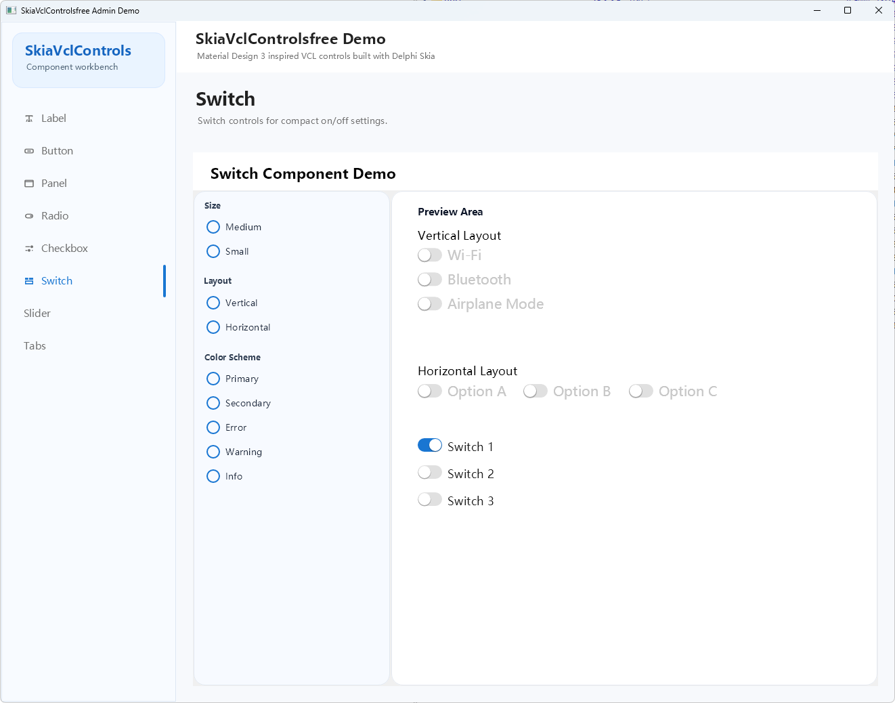
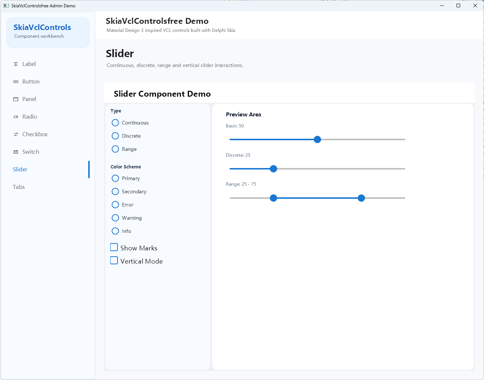
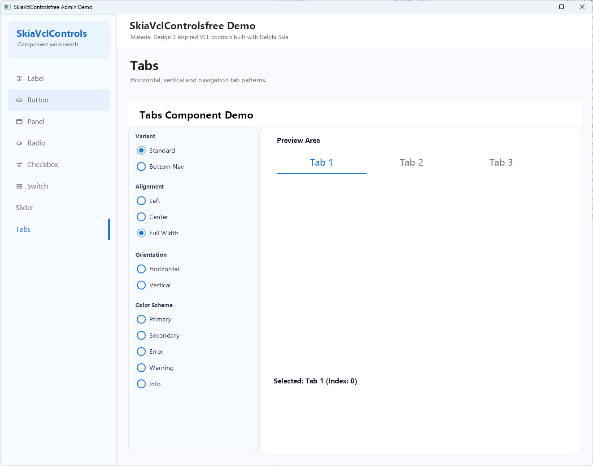

# SkiaVclControlsfree

基于 Delphi 内置 Skia 的 Material Design VCL 控件库（精简版）

[](https://www.embarcadero.com/products/delphi)
[](LICENSE)

**[English](README_EN.md)** | 中文

---

## 特性

- **Material Design 3** 风格设计
- **Skia 渲染** - 利用 Delphi 内置 Skia 支持，高质量图形渲染
- **DPI 感知** - 完美支持高 DPI 显示
- **流畅动画** - 内置悬停、点击动画效果（Ripple/Glow/ScaleUp）
- **MUI 主题** - 内置 Material-UI 配色方案
- **中文支持** - 自动检测并使用系统中文字体
- **透明渲染** - 支持 Alpha 通道透明度，父子控件透明合成
- **禁用状态** - 完整的 Enabled 禁用状态视觉支持
- **设计期预览** - 完整的设计期可视化编辑支持

---

## 控件列表

| 控件 | 说明 |
|------|------|
| `TDSkLabel` | Material Design 标签，支持渐变、描边、阴影效果 |
| `TDSkButton` | Material Design 按钮，支持 MUI 配色、Ripple 动画、多种样式和图标 |
| `TDSkPanel` | Material Design 面板，支持多种容器样式和悬停效果 |
| `TDSkRadio` | 单选按钮，MUI 风格，支持透明背景 |
| `TDSkRadioGroup` | 单选按钮组，自绘模式，支持标题显示 |
| `TDSkCheckbox` | 复选框，支持三态（未选中/选中/不确定） |
| `TDSkSwitch` | 开关控件，轨道+滑块滑动开关 |
| `TDSkSlider` | 滑块控件，支持连续/间续/范围/垂直滑块 |
| `TDSkTabs` | 选项卡，支持标准/底部导航样式，水平/垂直方向 |

---

## 系统要求

- **Delphi 11 Alexandria** 或更高版本（需内置 Skia 支持）
- **Windows** 平台
- **Skia 包** - Delphi 安装时需选择 Skia 支持

---

## 安装

### 方法一：通过 Delphi IDE 安装

1. 克隆或下载本仓库到本地
2. 打开 `SkiaVclControls.dpk`（设计时包）
3. 在 Project Manager 中右键点击 `SkiaVclControls.bpl`
4. 选择 **Compile**，然后选择 **Install**
5. 控件将出现在组件面板的 **SkiaVclControlsfree** 页签中

### 方法二：使用编译脚本

```batch
build.bat
```

然后手动安装生成的 `SkiaVclControls.bpl`

---

## 快速开始

### TDSkButton 使用示例

```delphi
uses
  SkiaVclControls.Button, SkiaVclControls.Types;

procedure TForm1.FormCreate(Sender: TObject);
begin
  Button1 := TDSkButton.Create(Self);
  Button1.Parent := Self;
  Button1.ButtonText := '点击我';
  Button1.MUIColorScheme := muiPrimary;
  Button1.MUIStyle := muiContained;
  Button1.HoverEffect := heRipple;  // MUI 风格 Ripple 动画
end;
```

### TDSkPanel 使用示例

```delphi
uses
  SkiaVclControls.Panel, SkiaVclControls.Types;

procedure TForm1.FormCreate(Sender: TObject);
begin
  Panel1 := TDSkPanel.Create(Self);
  Panel1.Parent := Self;
  Panel1.Caption := '标题';
  Panel1.PanelStyle := psOutlined;
  Panel1.CornerRadius := 12;
  Panel1.HoverEnabled := True;
end;
```

### TDSkRadioGroup 使用示例

```delphi
uses
  SkiaVclControls.RadioGroup, SkiaVclControls.Types;

procedure TForm1.FormCreate(Sender: TObject);
begin
  RadioGroup1 := TDSkRadioGroup.Create(Self);
  RadioGroup1.Parent := Self;
  RadioGroup1.Caption := '选择一项';
  RadioGroup1.Items.Add('选项一');
  RadioGroup1.Items.Add('选项二');
  RadioGroup1.Items.Add('选项三');
  RadioGroup1.ItemIndex := 0;
  RadioGroup1.Orientation := rgoVertical;
  RadioGroup1.ColorScheme := muiPrimary;
end;
```

---

## 项目结构

```
SkiaVclControlsfree/
├── Sources/                         # 源代码
│   ├── SkiaVclControls.Types.pas        # 共享类型、枚举
│   ├── SkiaVclControls.Base.pas         # 基类
│   ├── SkiaVclControls.LabelControl.pas # 标签
│   ├── SkiaVclControls.Button.pas       # 按钮
│   ├── SkiaVclControls.Panel.pas        # 面板
│   ├── SkiaVclControls.Radio.pas        # 单选按钮
│   ├── SkiaVclControls.RadioGroup.pas   # 单选按钮组
│   ├── SkiaVclControls.Checkbox.pas     # 复选框
│   ├── SkiaVclControls.Switch.pas       # 开关
│   ├── SkiaVclControls.Slider.pas       # 滑块
│   ├── SkiaVclControls.Tabs.pas         # 选项卡
│   ├── SkiaVclControls.MUIHelper.pas    # MUI 配色 Helper
│   └── SkiaVclControls.Register.pas     # 组件注册
├── Demo/                            # 演示程序（Frame架构）
│   ├── Shared/                      # 共享单元
│   │   └── Demo.Styles.pas          # 共享样式常量
│   ├── Frames/                      # 可复用的演示Frame
│   │   ├── Demo.Frame.LabelControl  # Label演示Frame
│   │   ├── Demo.Frame.Button        # Button演示Frame
│   │   ├── Demo.Frame.Panel         # Panel演示Frame
│   │   ├── Demo.Frame.Radio         # Radio演示Frame
│   │   ├── Demo.Frame.Checkbox      # Checkbox演示Frame
│   │   ├── Demo.Frame.Switch        # Switch演示Frame
│   │   ├── Demo.Frame.Slider        # Slider演示Frame
│   │   └── Demo.Frame.Tabs          # Tabs演示Frame
│   ├── Button/                      # 按钮演示
│   ├── Panel/                       # 面板演示
│   ├── Radio/                       # 单选按钮演示
│   ├── Slider/                      # 滑块演示
│   ├── Checkbox/                    # 复选框演示
│   ├── Switch/                      # 开关演示
│   ├── Tabs/                        # 选项卡演示
│   └── AdminDemo/                   # 综合展示Demo（Admin风格）
├── SkiaVclControls.dpk              # 设计时包
└── build.bat                        # 编译脚本
```

---

## Demo架构

### Frame架构设计

Demo采用**Frame架构**，实现代码复用和统一维护：

1. **共享层** (`Demo/Shared/`)
   - `Demo.Styles.pas`: Material Design 3 颜色常量、样式定义

2. **Frame层** (`Demo/Frames/`)
   - `Demo.Frame.*`: 各组件的演示Frame，可独立使用或嵌入其他容器

3. **单组件Demo** (`Demo/Button/`, `Demo/Panel/`, etc.)
   - 各组件独立演示程序

4. **综合Demo** (`Demo/AdminDemo/`)
   - Admin风格多页面UI
   - 左侧TDSkTabs垂直导航
   - 右侧动态切换Frame
   - 复用所有组件Frame

### 运行Demo

```bash
# 编译并运行单组件Demo
cd Demo/Button
dcc32 ButtonDemo.dpr

# 编译并运行综合Demo
cd Demo/AdminDemo
dcc32 AdminDemo.dpr
```

---

## 截图

### Admin 综合演示


### TDSkLabel 标签演示


### TDSkButton 按钮演示


### TDSkPanel 面板演示


### TDSkRadio 单选按钮演示


### TDSkCheckbox 复选框演示


### TDSkSwitch 开关演示


### TDSkSlider 滑块演示


### TDSkTabs 选项卡演示


---

## 贡献

欢迎提交 Issue 和 Pull Request！

---

## 许可证

本项目采用 [MIT](LICENSE) 许可证

---

## 致谢

- [Skia](https://skia.org/) - 强大的 2D 图形库
- [Material Design](https://m3.material.io/) - Google Material Design 3
- [Material-UI](https://mui.com/) - React UI 组件库（配色参考）
